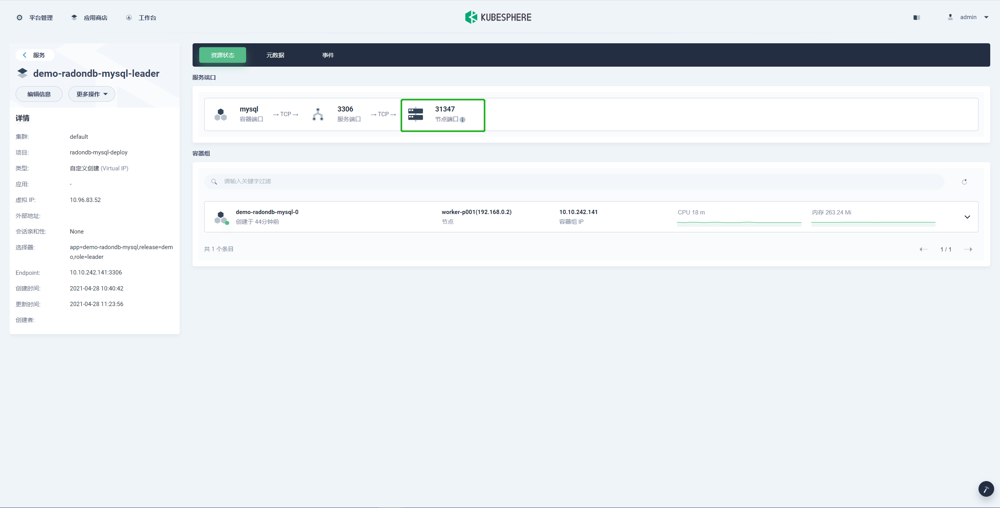
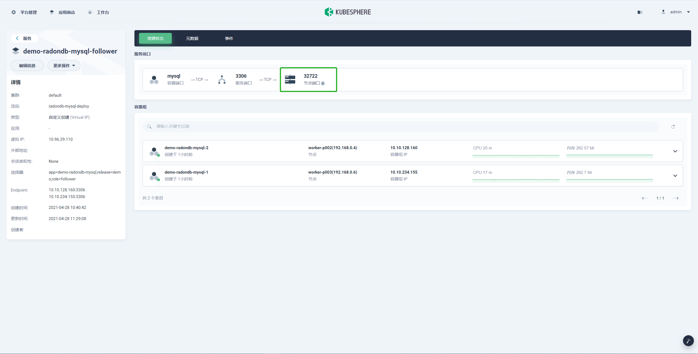

Contents
=================

   * [在 KubeSphere 上通过 Git 部署 RadonDB MySQL 集群](#在-kubesphere-上通过-git-部署-radondb-mysql-集群)
      * [简介](#简介)
      * [部署准备](#部署准备)
         * [安装 KubeSphere](#安装-kubesphere)
         * [创建 KubeSphere 多租户系统](#创建-kubesphere-多租户系统)
         * [连接 KubeSphere 客户端节点](#连接-kubesphere-客户端节点)
      * [部署步骤](#部署步骤)
         * [步骤 1：克隆 RadonDB MySQL Chart](#步骤-1克隆-radondb-mysql-chart)
         * [步骤 2：部署](#步骤-2部署)
         * [步骤 3：部署校验](#步骤-3部署校验)
      * [访问 RadonDB MySQL](#访问-radondb-mysql)
         * [开启服务网络访问](#开启服务网络访问)
         * [连接节点](#连接节点)
      * [配置](#配置)
      * [持久化](#持久化)
      * [自定义 MYSQL 配置](#自定义-mysql-配置)

# 在 KubeSphere 上通过 Git 部署 RadonDB MySQL 集群

## 简介

RadonDB MySQL 是基于 MySQL 的开源、高可用、云原生集群解决方案。通过使用 Raft 协议，RadonDB MySQL 可以快速进行故障转移，且不会丢失任何事务。

本教程演示如何在 KubeSphere 上通过 Git 部署 RadonDB MySQL 集群。

您还可以通过如下方式在 KubeSphere 上部署 RadonDB MySQL 集群：

- [在 KubeSphere 上通过 Helm Repo 部署 RadonDB MySQL 集群](deploy_radondb-mysql_on_kubesphere_repo.md)
- [在 KubeSphere 上通过 应用商店 部署 RadonDB MySQL 集群](deploy_radondb-mysql_on_kubesphere_appstore.md)

## 部署准备

### 安装 KubeSphere

可选择如下安装方式：

- 在 [青云 QingCloud AppCenter](https://appcenter.qingcloud.com/apps/app-cmgbd5k2) 上安装 Kubersphere。

- [在 Kubernetes 上安装 Kubersphere](https://kubesphere.io/zh/docs/installing-on-kubernetes/)。
  
- [在 Linux 上安装 Kubersphere](https://kubesphere.io/zh/docs/installing-on-linux/)。

### 创建 KubeSphere 多租户系统

参考 KubeSphere 官方文档：[创建企业空间、项目、帐户和角色](https://kubesphere.io/zh/docs/quick-start/create-workspace-and-project/)。

### 连接 KubeSphere 客户端节点

> 说明：如下示例适用于 KubeSphere 安装在 [青云QingCloud AppCenter](https://appcenter.qingcloud.com/apps/app-cmgbd5k2) 的场景。

通过[青云 QingCloud 控制台](https://console.qingcloud.com/) 直接连接客户端节点。

   

> - 默认 root 用户密码为 KubeSphere 集群 ID。
> - 通过第三方 SSH 工具连接客户端节点，需要在配置参数中填写 KubeSphere 的 `用户 SSH 公钥` 参数。

## 部署步骤

### 步骤 1：克隆 RadonDB MySQL Chart

在 KubeSphere 客户端节点执行如下命令，将 RadonDB MySQL Chart 克隆到 KubeSphere 客户端节点中。

   ```bash
   git clone https://github.com/radondb/radondb-mysql-kubernetes.git
   ```

> Chart 代表 [Helm](https://helm.sh/zh/docs/intro/using_helm/) 包，包含在 Kubernetes 集群内部运行应用程序、工具或服务所需的所有资源定义。

### 步骤 2：部署

在 radondb-mysql-kubernetes 目录路径下，选择如下方式，部署 RadonDB MySQL 实例。

> release 是运行在 Kubernetes 集群中的 Chart 的实例。
> 
* **默认部署方式**

  以下命令指定 release 名为 `demo`，将创建一个名为 `demo-radondb-mysql` 的有状态副本集。

  ```bash
   <For Helm v2>
    cd charts/helm
    helm install . demo

   <For Helm v3>
    cd charts/helm
    helm install demo .
  ```

* **指定参数部署方式**

  在 `helm install` 时使用 `--set key=value[,key=value]` ，可指定参数部署。
  
  以下示例将创建一个用户名为 `my-user` ，密码为 `my-password` 的标准数据库用户，可访问名为 `my-database` 的数据库。

  ```bash
  cd charts/helm
  helm install demo \
  --set mysql.mysqlUser=my-user,mysql.mysqlPassword=my-password,mysql.database=my-database .
  ```

   > 更多安装过程中可配置的参数，请参考 [配置](#配置) 。

* **配置 yaml 参数方式**

  执行如下命令，可通过 value.yaml 配置文件，在安装时配置指定参数。

  ```bash
  cd charts/helm
  helm install demo -f values.yaml .
  ```
  
### 步骤 3：部署校验

在**项目管理**管理中心，选择 **应用负载 > 工作负载**，并选择**有状态副本集**页签，可查看到名为 `demo-radondb-mysql` 的副本集，则 RadonDB MySQL 集群已成功部署。


## 访问 RadonDB MySQL

您需准备一个用于连接 RadonDB MySQL 的客户端。

> **注意：** 建议通过使用在同一 VPC 下主机或青云 VPN 服务来访问 RadonDB MySQL。不要通过端口转发的方式将服务暴露到公网，避免对数据库服务造成重大影响！

### 开启服务网络访问

1. 在 **项目管理** 界面中，选择 **应用负载** > **服务**，查看当前项目中的服务列表。

   


2. 进入需要开启外网访问的服务中，选择 **更多操作** > **编辑外网访问**。

   

   - **NodePort方式**

      选择 NodePort。

      

      点击确定自动生成转发端口，在 KubeSphere 集群同一网络内可通过集群IP/节点IP和此端口访问服务。

     

   - **Loadbalancer方式**

      选择 LoadBalancer。

      

     在 `service.beta.kubernetes.io/qingcloud-load-balancer-eip-ids` 参数中填写可用的 EIP ID，系统会自动为 EIP 创建负载均衡器和对应的监听器。

     在 `service.beta.kubernetes.io/qingcloud-load-balancer-type` 参数中填写负载均衡器承载能力类型，具体可查看 [CreateLoadBalancer](https://docs.qingcloud.com/product/api/action/lb/create_loadbalancer.html)。

     点击确定自动生成转发端口，在 KubeSphere 集群同一网络内可通过集群IP/节点IP和此端口访问服务。

      

### 连接节点

使用如下命令连接节点。

   ```bash
   mysql -h <访问 IP> -u <用户名> -P <访问端口> -p
   ```

当客户端与 RadonDB MySQL 集群在同一个项目中时，可使用 leader/follower service 名称代替具体的 ip 和端口。

- 连接主节点(读写节点)。

   ```bash
   mysql -h <leader service 名称> -u <用户名> -p
   ```

- 连接从节点(只读节点)。

  ```bash
  mysql -h <follower service 名称> -u <用户名> -p
  ```
  
> 使用外网主机连接可能会出现 `SSL connection error`，需要加上 `--ssl-mode=DISABLE` 参数，关闭 SSL。

## 配置

下表列出了 RadonDB MySQL Chart 的配置参数及对应的默认值。

| 参数                                          | 描述                                                     |  默认值                                 |
| -------------------------------------------- | -------------------------------------------------------- | -------------------------------------- |
| `imagePullPolicy`                            | 镜像拉取策略                                               | `IfNotPresent`                         |
| `fullnameOverride`                           | 自定义全名覆盖                                             |                                         |
| `nameOverride`                               | 自定义名称覆盖                                             |                                         |
| `replicaCount`                               | Pod 数目                                                 | `3`                                     |
| `busybox.image`                              | `busybox` 镜像库地址                                       | `busybox`                               |
| `busybox.tag`                                | `busybox` 镜像标签                                        | `1.32`                                   |
| `mysql.image`                                | `mysql` 镜像库地址                                         | `radondb/percona`                     |
| `mysql.tag`                                  | `mysql` 镜像标签                                          | `5.7.34`                               |
| `mysql.allowEmptyRootPassword`               | 如果为 `true`，允许 root 账号密码为空                       | `true`                                  |
| `mysql.mysqlRootPassword`                    | `root` 用户密码                                          |                                          |
| `mysql.mysqlReplicationPassword`             | `qc_repl` 用户密码                                         | `Repl_123`, 如果没有设置则随机12个字符      |
| `mysql.mysqlUser`                            | 新建用户的用户名                                           | `qingcloud`                              |
| `mysql.mysqlPassword`                        | 新建用户的密码                                             | `Qing@123`, 如果没有设置则随机12个字符      |
| `mysql.mysqlDatabase`                        | 将要创建的数据库名                                          | `qingcloud`                             |
| `mysql.initTokudb`                           | 安装 tokudb 引擎                                          | `false`                                 |
| `mysql.args`                                 | 要传递到 mysql 容器的其他参数                                | `[]`                                    |
| `mysql.configFiles.node.cnf`                 | Mysql 配置文件                                            | 详见 `values.yaml`                      |
| `mysql.livenessProbe.initialDelaySeconds`    | Pod 启动后首次进行存活检查的等待时间                          | 30                                      |
| `mysql.livenessProbe.periodSeconds`          | 存活检查的间隔时间                                           | 10                                      |
| `mysql.livenessProbe.timeoutSeconds`         | 存活探针执行检测请求后，等待响应的超时时间                       | 5                                       |
| `mysql.livenessProbe.successThreshold`       | 存活探针检测失败后认为成功的最小连接成功次数                     | 1                                       |
| `mysql.livenessProbe.failureThreshold`       | 存活探测失败的重试次数，重试一定次数后将认为容器不健康             | 3                                       |
| `mysql.readinessProbe.initialDelaySeconds`   | Pod 启动后首次进行就绪检查的等待时间                           | 10                                      |
| `mysql.readinessProbe.periodSeconds`         | 就绪检查的间隔时间                                           | 10                                      |
| `mysql.readinessProbe.timeoutSeconds`        | 就绪探针执行检测请求后，等待响应的超时时间                       | 1                                       |
| `mysql.readinessProbe.successThreshold`      | 就绪探针检测失败后认为成功的最小连接成功次数                      | 1                                      |
| `mysql.readinessProbe.failureThreshold`      | 就绪探测失败的重试次数，重试一定次数后将认为容器未就绪              | 3                                      |
| `mysql.extraEnvVars`                         | 其他作为字符串传递给 `tpl` 函数的环境变量                       |                                         |
| `mysql.resources`                            | `MySQL` 的资源请求/限制                                      | 内存: `256Mi`, CPU: `100m`              |
| `xenon.image`                                | `xenon` 镜像库地址                                          | `radondb/xenon`                       |
| `xenon.tag`                                  | `xenon` 镜像标签                                            | `1.1.5-alpha`                          |
| `xenon.args`                                 | 要传递到 xenon 容器的其他参数                                 | `[]`                                   |
| `xenon.extraEnvVars`                         | 其他作为字符串传递给 `tpl` 函数的环境变量                        |                                        |
| `xenon.livenessProbe.initialDelaySeconds`    | Pod 启动后首次进行存活检查的等待时间                             | 30                                     |
| `xenon.livenessProbe.periodSeconds`          | 存活检查的间隔时间                                            | 10                                     |
| `xenon.livenessProbe.timeoutSeconds`         | 存活探针执行检测请求后，等待响应的超时时间                        | 5                                      |
| `xenon.livenessProbe.successThreshold`       | 存活探针检测失败后认为成功的最小连接成功次数                      | 1                                      |
| `xenon.livenessProbe.failureThreshold`       | 存活探测失败的重试次数，重试一定次数后将认为容器不健康              | 3                                      |
| `xenon.readinessProbe.initialDelaySeconds`   | Pod 启动后首次进行就绪检查的等待时间                            | 10                                     |
| `xenon.readinessProbe.periodSeconds`         | 就绪检查的间隔时间                                            | 10                                     |
| `xenon.readinessProbe.timeoutSeconds`        | 就绪探针执行检测请求后，等待响应的超时时间                        | 1                                      |
| `xenon.readinessProbe.successThreshold`      | 就绪探针检测失败后认为成功的最小连接成功次数                       | 1                                      |
| `xenon.readinessProbe.failureThreshold`      | 就绪探测失败的重试次数，重试一定次数后将认为容器未就绪              | 3                                      |
| `xenon.resources`                            | `xenon` 的资源请求/限制                                      | 内存: `128Mi`, CPU: `50m`               |
| `metrics.enabled`                            | 以 side-car 模式开启 Prometheus Exporter                     | `true`                                 |
| `metrics.image`                              | Exporter 镜像地址                                            | `prom/mysqld-exporter`                 |
| `metrics.tag`                                | Exporter 标签                                               | `v0.12.1`                              |
| `metrics.annotations`                        | Exporter 注释                                               | `{}`                                   |
| `metrics.livenessProbe.initialDelaySeconds`  | Pod 启动后首次进行存活检查的等待时间                            | 15                                     |
| `metrics.livenessProbe.timeoutSeconds`       | 存活探针执行检测请求后，等待响应的超时时间                        | 5                                      |
| `metrics.readinessProbe.initialDelaySeconds` | Pod 启动后首次进行就绪检查的等待时间                            | 5                                      |
| `metrics.readinessProbe.timeoutSeconds`      | 就绪探针执行检测请求后，等待响应的超时时间                        | 1                                      |
| `metrics.serviceMonitor.enabled`             | 若设置为 `true`, 将为 Prometheus operator 创建 ServiceMonitor | `true`                                 |
| `metrics.serviceMonitor.namespace`           | 创建 ServiceMonitor 时，可指定命名空间                         | `nil`                                   |
| `metrics.serviceMonitor.interval`            | 数据采集间隔，若未指定，将使用 Prometheus 默认设置                | 10s                                     |
| `metrics.serviceMonitor.scrapeTimeout`       | 数据采集超时时间，若未指定，将使用 Prometheus 默认设置             | `nil`                                   |
| `metrics.serviceMonitor.selector`            | 默认为 kube-prometheus                                       | `{ prometheus: kube-prometheus }`       |
| `slowLogTail`                                | 若设置为 `true`，将启动一个容器用来查看 mysql-slow.log           | `true`                                 |
| `resources`                                  | 资源 请求/限制                                               | 内存: `32Mi`, CPU: `10m`                |
| `service.annotations`                        | Kubernetes 服务注释                                         | {}                                     |
| `service.type`                               | Kubernetes 服务类型                                         | NodePort                                |
| `service.loadBalancerIP`                     | 服务负载均衡器 IP                                            | `""`                                   |
| `service.nodePort`                           | 服务节点端口                                                 | `""`                                   |
| `service.clusterIP`                          | 服务集群 IP                                                 | `""`                                   |
| `service.port`                               | 服务端口                                                    | `3306`                                 |
| `rbac.create`                                | 若为 true,将创建和使用 RBAC 资源                              | `true`                                  |
| `serviceAccount.create`                      | 指定是否创建 ServiceAccount                                  | `true`                                  |
| `serviceAccount.name`                        | ServiceAccount 的名称                                       |                                         |
| `persistence.enabled`                        | 创建一个卷存储数据                                           | true                                   |
| `persistence.size`                           | PVC 容量                                                  | 10Gi                                   |
| `persistence.storageClass`                   | PVC 类型                                                  | nil                                    |
| `persistence.accessMode`                     | 访问模式                                                   | ReadWriteOnce                          |
| `persistence.annotations`                    | PV 注解                                                   | {}                                     |
| `priorityClassName`                          | 设置 Pod 的 priorityClassName                              | `{}`                                   |
| `schedulerName`                              | Kubernetes scheduler 名称(不包括默认)                        | `nil`                                  |
| `statefulsetAnnotations`                     | StatefulSet 注释                                           | `{}`                                   |
| `podAnnotations`                             | Pod 注释 map                                               | `{}`                                   |
| `podLabels`                                  | Pod 标签 map                                               | `{}`                                   |

## 持久化  

[MySQL](https://hub.docker.com/repository/docker/radondb/percona) 镜像在容器路径 `/var/lib/mysql` 中存储 MYSQL 数据和配置。

默认情况下，会创建一个 PersistentVolumeClaim 并将其挂载到指定目录中。 若想禁用此功能，您可以更改 `values.yaml` 禁用持久化，改用 emptyDir。

> *"当 Pod 分配给节点时，将首先创建一个 emptyDir 卷，只要该 Pod 在该节点上运行，该卷便存在。 当 Pod 从节点中删除时，emptyDir 中的数据将被永久删除."*

**注意**：PersistentVolumeClaim 中可以使用不同特性的 PersistentVolume，其 IO 性能会影响数据库的初始化性能。所以当使用 PersistentVolumeClaim 启用持久化存储时，可能需要调整 livenessProbe.initialDelaySeconds 的值。数据库初始化的默认限制是60秒 (livenessProbe.initialDelaySeconds + livenessProbe.periodSeconds * livenessProbe.failureThreshold)。如果初始化时间超过限制，kubelet将重启数据库容器，数据库初始化被中断，会导致持久数据不可用。

## 自定义 MYSQL 配置

在 `mysql.configFiles` 中添加/更改 MySQL 配置。

```yaml
  configFiles:
    node.cnf: |
      [mysqld]
      default_storage_engine=InnoDB
      max_connections=65535

      # custom mysql configuration.
      expire_logs_days=7
```
